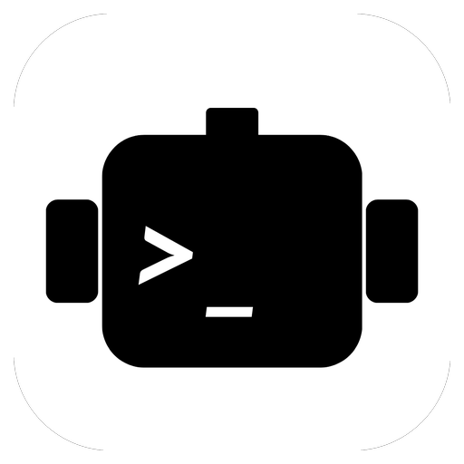
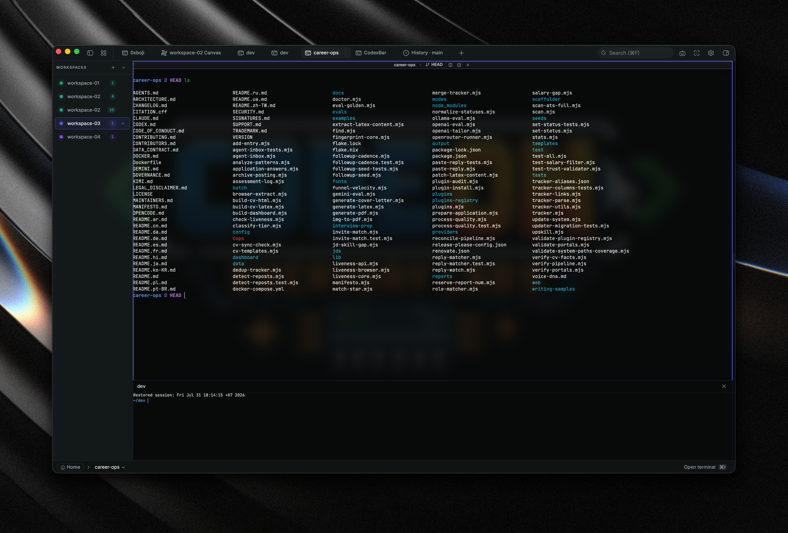
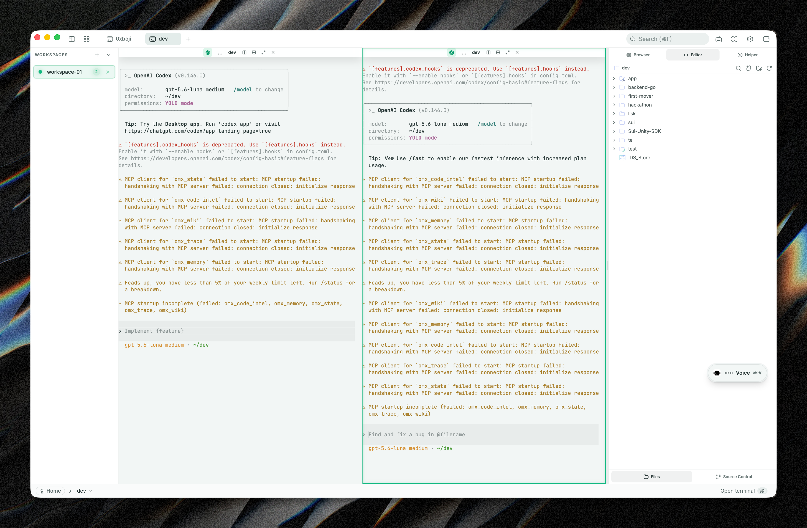
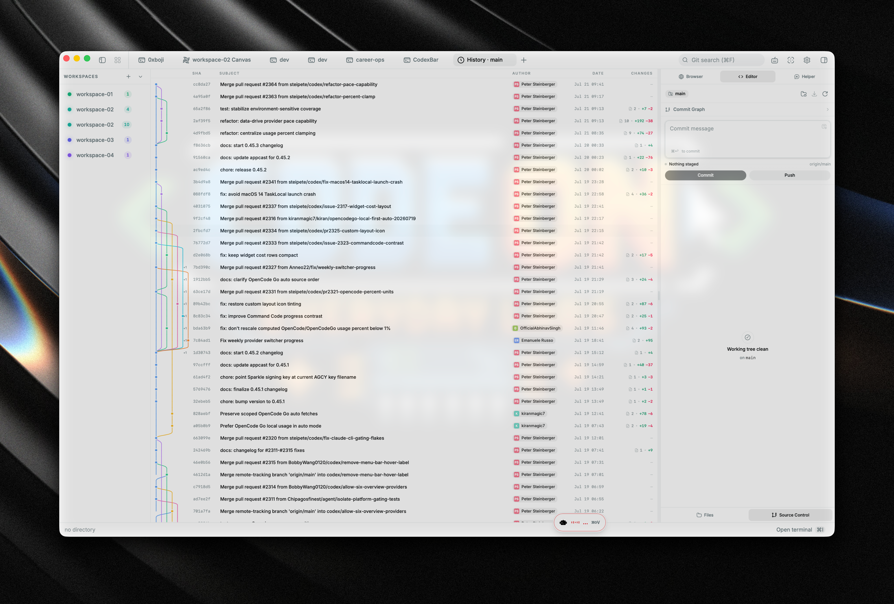
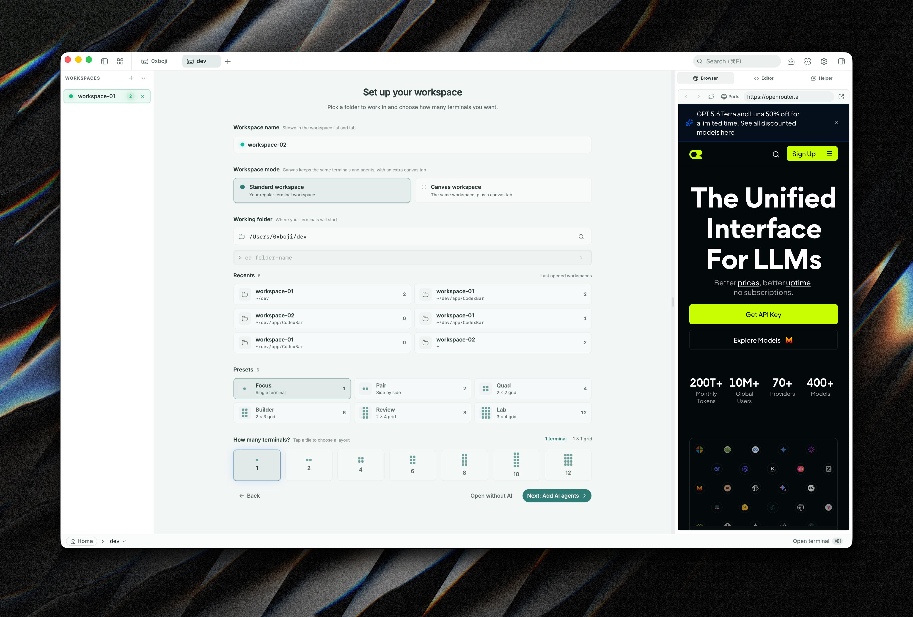
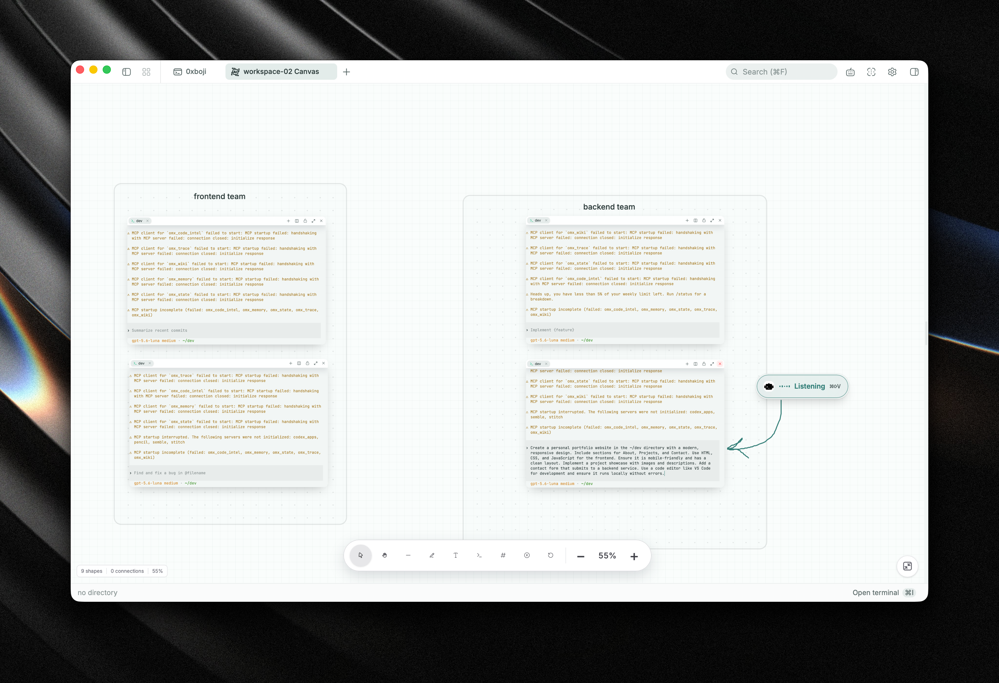
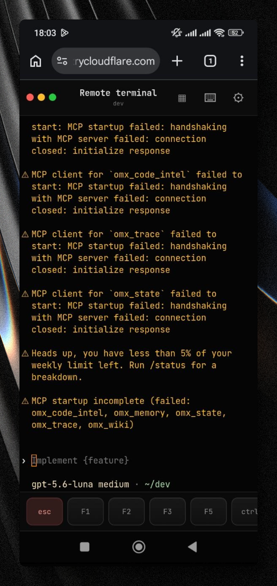

<div align="center">
  
  <h1>cmdSpace</h1>
  <p><strong>A terminal-first, AI-native development workspace.</strong></p>
  <p>
    
    
    
  </p>
</div>

cmdSpace is an open-source desktop development workspace built with Tauri 2, Rust, React 19, and a native PTY backend. It combines real terminals, AI coding agents, a code editor, file navigation, source control, local web previews, and a spatial Canvas for arranging development work visually.

No account is required. There is no telemetry. AI can use your own provider keys or local models.

## Screenshots

<p align="center"></p>
<p align="center"><em>Native terminal workspace with WebGL rendering</em></p>

<p align="center"></p>
<p align="center"><em>Code editor, file explorer, and AI-assisted workflows</em></p>

<p align="center"></p>
<p align="center"><em>Source control and commit history</em></p>

<p align="center"></p>
<p align="center"><em>Preview local development servers in-app</em></p>

<p align="center"></p>
<p align="center"><em>Agentic AI workflow with reviewable code edits</em></p>

<p align="center"></p>
<p align="center"><em>Remote terminal access from a mobile browser</em></p>

## Features

### Real terminal workspaces

- Native PTY sessions powered by `portable-pty`.
- xterm.js with WebGL rendering, true color, search, links, and background streaming.
- Multi-tab terminals with horizontal and vertical splits.
- Shell support for zsh, bash, fish, PowerShell, pwsh, WSL, and cmd.exe.
- Workspace-specific working directories and terminal environments.
- Clickable folders and Git branches for fast navigation.
- Copy-on-select, keyboard shortcuts, restored sessions, and scrollback.
- Windows WSL environments are first-class workspaces rather than wrapped subprocesses.

### Canvas mode

- Create a normal workspace or a Canvas workspace with the same terminal, directory, and AI-agent setup flow.
- Add independent, real PTY-backed terminal nodes directly to an infinite canvas.
- Drag, resize, lock, close, and rearrange terminals without sharing the standard terminal-pane lifecycle.
- Group terminals by dropping them beside, above, or into another terminal group.
- Split groups horizontally or vertically and drag the divider to resize panes.
- Drag a terminal into a frame to associate it with that frame.
- Persist Canvas positions, sizes, groups, splits, frames, lock state, current directory, and terminal metadata.
- Pan and zoom the canvas smoothly, including over terminal surfaces; use the hand tool or trackpad gestures.
- Add frames, text, lines, and drawings; one-shot tools return to the selection tool after creation.
- Keep legacy image nodes readable while the toolbar uses real terminal nodes.

### AI coding agents

- Agentic workflows with plans, sub-agents, project memory, file read/write/edit, multi-edit, grep, glob, and approved shell commands.
- OpenAI Codex, Anthropic, Google Gemini, Groq, xAI, Cerebras, OpenRouter, DeepSeek, Mistral, and other OpenAI-compatible endpoints.
- Local inference through LM Studio, MLX, and Ollama.
- Custom agents with separate prompts and tool permissions.
- Composer prompts with `@` file references, `#` snippets, slash commands, and attach-from-selection or file explorer.
- Reviewable code edits with accept/reject controls and plan mode.
- Standard and Canvas terminals can start configured CLI agents in the selected working directory.

### Voice input

- Voice agent controls are available across normal workspaces, Canvas, and terminal surfaces.
- Automatic language detection supports Vietnamese, English, and other spoken languages without a manual language selector.
- Voice can remain active while a CLI agent is running.
- The voice control is draggable and stays above the workspace UI.

### Code editor

- CodeMirror 6 with support for TypeScript/JavaScript, Rust, Python, Go, C/C++, Java, HTML/CSS, JSON, Markdown, PHP, and more.
- Inline AI autocomplete and reviewable AI diffs.
- Vim mode.
- Built-in Atom One, Aura, Copilot, GitHub, Gruvbox, Nord, Tokyo Night, and Xcode themes.

### Source control and files

- Stage and unstage changes, commit with Cmd+Enter / Ctrl+Enter, and push with upstream awareness.
- Branch display, detached-HEAD support, commit search, and a graphical merge history.
- Catppuccin file icons, fuzzy search, keyboard navigation, inline rename, and context actions.
- Attach files or selected ranges directly to an AI prompt.

### Web preview and appearance

- Detect local development servers and preview them in-app.
- Open external URLs in a native child webview.
- Light and dark themes with independent editor themes.
- Custom themes, background images, opacity, blur, and workspace panel collapse.

## Install

Download the latest installers from the [GitHub Releases](https://github.com/codeoneveryday-labs/cmdSpace/releases/latest) page.

Available packages include:

- macOS: `.dmg` for Apple Silicon and Intel.
- Windows: `.msi` and `.exe`.
- Linux: `.AppImage`, `.deb`, and `.rpm`.

macOS public releases are signed and notarized through Apple Developer ID before publishing. Linux AppImages may need FUSE; if unavailable, run them with `--appimage-extract-and-run`.

## Configure AI

1. Open **Settings → AI**.
2. Choose a provider and enter its API key, or configure a local LM Studio, MLX, or Ollama endpoint.
3. Provider credentials are stored in the operating system keychain through `keyring`, not in localStorage.

## Build from source

### Prerequisites

- Rust stable: <https://rustup.rs>
- Node 20 or newer
- [pnpm](https://pnpm.io)
- Tauri platform prerequisites: <https://tauri.app/start/prerequisites/>

### Run

```bash
pnpm install
pnpm tauri dev
```

### Build and verify

```bash
pnpm build
pnpm test
cd src-tauri && cargo check --all-targets --locked
```

For Windows smoke testing, including native voice recognition and WSL coverage, see [Windows testing](docs/WINDOWS_TESTING.md).

## Release automation

GitHub Actions builds macOS, Windows, and Linux artifacts. macOS release jobs fail closed unless all Developer ID signing and notarization secrets are configured. See [macOS release signing](docs/MACOS_RELEASE_SIGNING.md) for the maintainer runbook.

## Tech stack

Tauri 2, Rust, `portable-pty`, React 19, TypeScript, Vite, xterm.js, CodeMirror 6, Vercel AI SDK, Tailwind CSS, shadcn/ui, and Zustand.

## Contributing

Issues and pull requests are welcome. Please read the project instructions in [AGENTS.md](AGENTS.md), the architecture notes in [docs/ARCHITECTURE.md](docs/ARCHITECTURE.md), and the repository workflow in [docs/WORKFLOW.md](docs/WORKFLOW.md).

## License

cmdSpace is licensed under the Apache-2.0 License. See [LICENSE](LICENSE).
